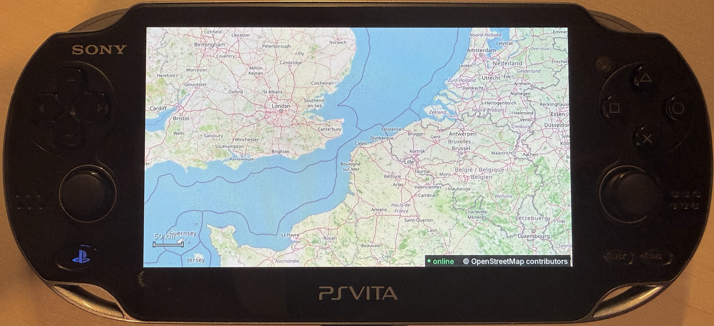
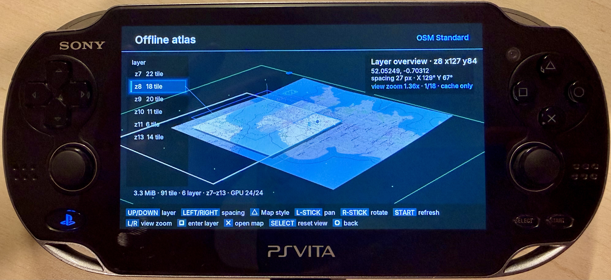
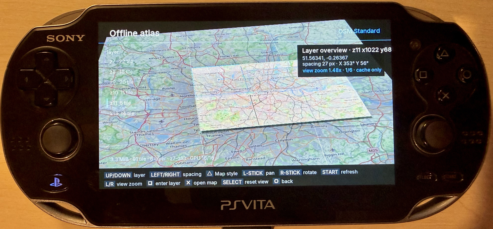

# VitaMaps

VitaMaps is a native, GPU-rendered map viewer and cache explorer for
PlayStation Vita homebrew. It uses VitaSDK and vita2d directly—there is no
WebView, embedded browser, HTML, or JavaScript map engine.

- **Version:** 01.23 public beta
- **Title ID:** `VMAP00001`
- **License:** [GPL-3.0-only](LICENSE)
- **Networking:** [spyro-98/vita-https](https://github.com/spyro-98/vita-https)

[Download releases](https://github.com/spyro-98/VitaMaps/releases) ·
[Read the feature guide](docs/FEATURES.md) ·
[View all controls](docs/CONTROLS.md) ·
[Report an issue](https://github.com/spyro-98/VitaMaps/issues)

## Screenshots

<p align="center">
  
</p>
<p align="center"><em>Native raster map rendering on PlayStation Vita hardware.</em></p>

<table>
  <tr>
    <td width="50%">
      
    </td>
    <td width="50%">
      
    </td>
  </tr>
  <tr>
    <td align="center"><em>Zoom layers separated in 3D.</em></td>
    <td align="center"><em>Real cached tiles projected into the atlas.</em></td>
  </tr>
</table>

## Offline Atlas and layered tile engine

The **Offline Atlas** is VitaMaps' experimental signature feature. It began
with a simple question: *what is actually stored inside the map cache?* The
atlas scans tiles collected during normal browsing and turns them into an
interactive 3D structure organized by map style, geographic coverage, and zoom
level.

```text
persistent cache
      |
      v
style index -> zoom layers -> geographic tile neighbourhoods
                                     |
                                     v
                        RAM/decode/GPU tile pipeline
                                     |
                                     v
                           perspective 3D quads
```

Each layer contains real cached XYZ imagery, not a generated preview. The user
can orbit the stack through 360 degrees, change the distance between zoom
levels, pan the complete block, enter a selected layer, browse concrete cached
tile keys, zoom into their geography, and reopen any selected tile in the
normal map at the matching style and zoom.

Atlas requests are strictly **cache-only**. Missing files remain visible as
gaps and can never become provider downloads. This beta is both a practical
cache browser and a way to evaluate a future area/zoom offline workflow; that
bulk-download system is not part of the current release.

Read [Features: Offline Atlas](docs/FEATURES.md#offline-atlas-beta) for the
complete behavior and [Architecture](docs/ARCHITECTURE.md#cache-hierarchy) for
the projection, scheduling, memory, and GPU contracts.

## Highlights

| Area | What VitaMaps provides |
|---|---|
| Native map | Continuous Web Mercator pan, fractional zoom, rotation, touch gestures, inertia, and GPU tile rendering |
| Tile pipeline | Dynamic viewport priority, cancellation, bounded retries, progressive parent/child fallback, and animated missing-tile loaders |
| Map styles | OSM Standard, CyclOSM, OSM France, Humanitarian, and OpenTopoMap behind an abstract provider interface |
| Persistent cache | Separate non-expiring 200 MiB LRU cache for every style, with live status and safe clearing |
| Mapping tools | Search, styled pin lists, per-segment/total distance, closed-polygon area, and map visibility per list |
| Hiking and POIs | Automatic OpenTopoMap hiking mode, Overpass POIs, and elevation profiles with ascent/descent |
| GPX | Bounded GPX 1.0/1.1 waypoint, route, and track import; GPX 1.1 export; persistent import history |
| Native UI | Auto-hiding HUD, scale bar, online/offline state, smooth motion, reduced-motion mode, and categorized Settings |
| Languages | Italian, English, Japanese, Korean, Simplified/Traditional Chinese, Russian, French, Spanish, German, and Portuguese |
| Diagnostics | Bounded RAM log, optional atomic disk log, visible boot progress, and a fallback fatal screen |

The complete functional specification lives in [docs/FEATURES.md](docs/FEATURES.md).

## Install

1. Download `VitaMaps.vpk` from the
   [GitHub release page](https://github.com/spyro-98/VitaMaps/releases).
2. Transfer it to the PS Vita.
3. Install it with VitaShell and launch VitaMaps from LiveArea.

Settings, logs, pins, GPX data, search results, and map caches are stored under
`ux0:data/VitaMaps/`. Removing the LiveArea application does not necessarily
remove that directory.

## Build from source

`vita-https` is pinned as a Git submodule, so VitaMaps is independently
cloneable and does not depend on another local project.

```sh
git clone --recursive https://github.com/spyro-98/VitaMaps.git
cd VitaMaps
export VITASDK=/absolute/path/to/vitasdk
external/vita-https/tools/build-curl-mbedtls.sh
cmake -S . -B build -DCMAKE_BUILD_TYPE=Release
cmake --build build --parallel 4
```

The package is generated at `build/VitaMaps.vpk`. A current VitaSDK toolchain
and its vita2d, Mbed TLS 3.x, libpng, zlib, JPEG, FreeType, bzip2, and pthread
packages are required. If submodules were omitted during clone, run:

```sh
git submodule update --init --recursive
```

For the diagnostic build, which enables persistent logging by default on a new
installation:

```sh
cmake -S . -B build-debug -DCMAKE_BUILD_TYPE=Debug
cmake --build build-debug --parallel 4
```

## Documentation

| Document | Contents |
|---|---|
| [Feature guide](docs/FEATURES.md) | Map engine, layered atlas, caching, lists, search, GPX, hiking, UI, localization, and diagnostics |
| [Controls](docs/CONTROLS.md) | Complete map, atlas, list, GPX, Settings, and global input reference |
| [Architecture](docs/ARCHITECTURE.md) | Threading, coordinate spaces, tile state machine, scheduling, cache budgets, GPU ownership, and extension points |
| [Public beta guide](docs/PUBLIC_BETA.md) | Installation, privacy, testing priorities, diagnostics, and known limitations |
| [Changelog](CHANGELOG.md) | Version history and release boundary |
| [Third-party notices](THIRD_PARTY_NOTICES.md) | Libraries, services, map data, fonts, and image attribution |

## Current beta boundaries

- The Offline Atlas visualizes accumulated cache; it is not an area downloader
  and does not guarantee complete regional coverage.
- Raster labels are embedded in provider tiles and cannot be resized or styled
  independently.
- Pin geometry provides direct distance and area measurements, not road routing
  or turn-by-turn navigation.
- Community tile and search services are best-effort and may rate-limit or fail.
- Release and Debug 01.23 VPKs pass local VitaSDK build/package validation, but
  the exact package still requires broad physical-console testing.

## License and attribution

Copyright (C) 2026 spyro-98. VitaMaps is licensed under
[GNU GPL version 3 only](LICENSE).

OpenStreetMap data attribution remains visible inside the map renderer.
Third-party components and services retain their own terms; see
[THIRD_PARTY_NOTICES.md](THIRD_PARTY_NOTICES.md).

The application icon is derived from NASA's Apollo 17
[“Blue Marble” photograph AS17-148-22727](https://science.nasa.gov/resource/the-blue-marble/).
Image credit: NASA Johnson Space Center. The icon contains no NASA identifier
or logo and does not imply NASA endorsement; see NASA's
[image and media usage guidelines](https://www.nasa.gov/nasa-brand-center/images-and-media/).

VitaMaps is not affiliated with or endorsed by Sony Interactive Entertainment,
OpenStreetMap Foundation, the listed map providers, Open-Meteo, Copernicus,
Natural Earth, or NASA.
